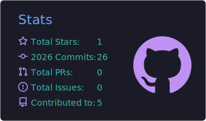
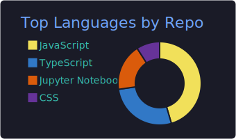

<!-- <h1 align="left">Hi, I'm Sravan Saiba 👋</h1>
<h3 align="left">Full-Stack Engineer</h3>

 <p align="center">
  
</p>

---

## 🧠 About Me

* ⚙️ Building **Marinate360** — a multi-tenant restaurant SaaS platform
* ⚡ Focused on **real-time systems, POS workflows & system reliability**
* 📱 Working across **Web + Mobile (React Native)**
* 🧩 Interested in **scalable architecture & system design**

---

## 🚀 Tech Stack

<p>

</p>

---

## 📊 GitHub Stats

<p align="center">
  
  
</p>

---

## 📈 Activity Graph

<p align="center">
  
</p>

---

## 🏗️ Featured Work

* 🍽 **Marinate360 POS System** (Realtime + Multi-tenant)
* 🛒 **Food Ordering Platform**
* 📱 **Restaurant Staff Mobile Apps**
* 🌐 Client Projects (Regal Interiors, Par9Visa, Sileo)

---

## 🌐 Connect

<p>
<a href="https://sravansaiba.vercel.app">Portfolio</a> •
<a href="https://github.com/sravansaiba">GitHub</a> •
<a href="https://linkedin.com/in/sravansaiba">LinkedIn</a>
</p>

---

 -->


<div align="center">


<br/>

[](https://sravansaiba.vercel.app)
[](https://linkedin.com/in/sravansaiba)
[](mailto:sravansaiba@gmail.com)
[](https://github.com/sravansaiba)

</div>

---

## `$ whoami`

```ts
const sravan = {
  role      : "Full-Stack Engineer",
  location  : "Hyderabad, Telangana, IN",
  experience: "1+ year in production delivery",
  current   : "Building Marinate360 — multi-tenant restaurant SaaS",
  focus     : ["Real-time systems", "POS workflows", "Mobile (RN)", "AI tooling"],
  instinct  : "Frontend-first. Backend-ready. Ships things.",
};
```

---

## `$ cat tech-stack.json`

**Frontend**


**Backend & APIs**


**Data & Auth**


**DevOps & Infra**


---

## `$ ls ./projects`

| Project | What it is | Stack | Status |
|---|---|---|---|
| **[Marinate360](https://marinate360.com)** | Multi-tenant restaurant SaaS — QR ordering, POS, real-time ops, payments | Next.js · Supabase · Razorpay · PostgreSQL | 🟢 Live |
| **[Regal Interiors](https://theregalinteriors.com)** | Luxury interior brand site with lead capture flow | Next.js · Resend · Tailwind | 🟢 Live |
| **ParkScan** | QR-based parking management app — sessions, pricing, PDF/Excel exports | React Native · Supabase · Expo | 🟢 Client delivery |

---

## `$ git log --stats`

<!-- Stats are generated by GitHub Actions and committed as real image files. -->
<!-- See .github/workflows/stats.yml — runs every 24h. -->

<div align="center">


&nbsp;&nbsp;


</div>

<div align="center">



</div>

---

## `$ tail -f activity.log`

<!-- Snake is also generated by GitHub Actions — see stats.yml -->
<div align="center">

<picture>
  <source media="(prefers-color-scheme: dark)" srcset="./assets/snake-dark.svg"/>
  <source media="(prefers-color-scheme: light)" srcset="./assets/snake-light.svg"/>
  
</picture>

</div>

---

## `$ cat experience.log`

```
[2025 → now]  Full Stack Developer @ Orzyn Tech Pvt. Ltd.
              └─ ERP, POS, QR ordering, client-facing platforms

[2024 → 2025] Frontend Developer @ Vidyardi Institutions Pvt. Ltd.
              └─ React interfaces, CMS-driven product flows
```

---

## `$ ping me`

```bash
# Open to:
#   → Full-time roles (full-stack, frontend-heavy)
#   → Freelance product builds
#   → Interesting problems involving real-time, mobile, or AI

curl -X POST https://sravansaiba.vercel.app/contact \
  -d "message=let's build something"
```

<div align="center">

[](https://sravansaiba.vercel.app)

</div>

---

<div align="center">
<sub>Hyderabad · Full-Stack · Next.js · React Native · Interested in AI tooling and scalable systems</sub>
</div>

